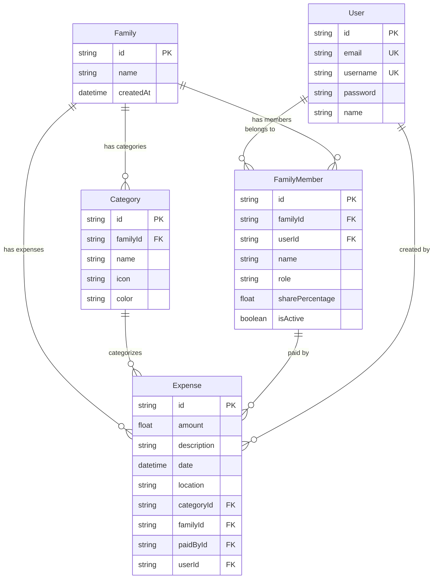
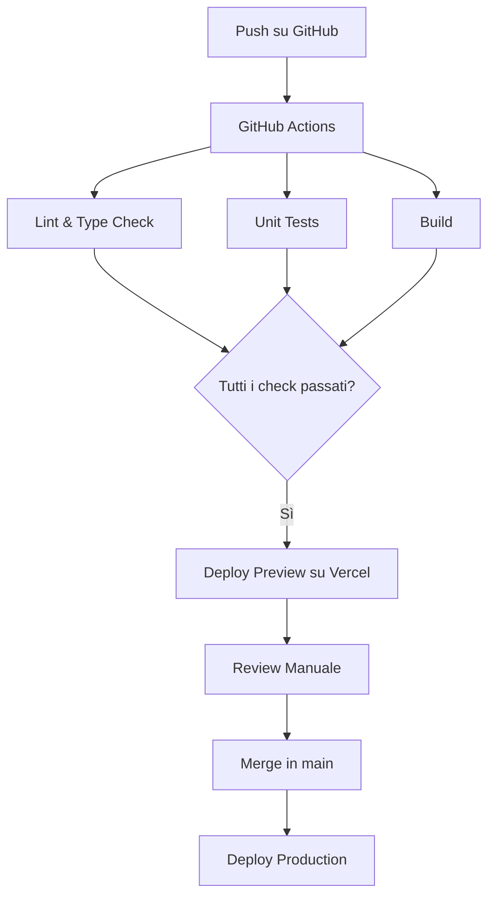

# 📱 Gestionale Spese Famiglia - PWA

[](https://nextjs.org/)
[](https://www.typescriptlang.org/)
[](https://www.prisma.io/)
[](https://tailwindcss.com/)
[](./LICENSE)
[](https://web.dev/progressive-web-apps/)
[](https://gestionale-spese-famiglia-pwa.vercel.app)

> Una moderna Progressive Web App per la gestione delle spese familiari, costruita con Next.js 14, TypeScript e architettura full-stack.

**🌐 [Demo Live](https://gestionale-spese-famiglia-pwa.vercel.app/auth/signin)** | **📖 [Documentazione](./README.md)** | **🗺️ [Roadmap](./ROADMAP.md)** | **🤝 [Contributing](./CONTRIBUTING.md)**

## 📋 Indice

- [Panoramica](#-panoramica)
- [Architettura Tecnica](#-architettura-tecnica)
- [Tecnologie e Dipendenze](#-tecnologie-e-dipendenze)
- [Struttura del Progetto](#-struttura-del-progetto)
- [Funzionalità](#-funzionalità)
- [Setup e Installazione](#-setup-e-installazione)
- [Configurazione Database](#-configurazione-database)
- [Autenticazione](#-autenticazione)
- [PWA Features](#-pwa-features)
- [API Endpoints](#-api-endpoints)
- [Deployment](#-deployment)
- [Sviluppo](#-sviluppo)
- [Testing](#-testing)
- [Accessibilità e Localizzazione](#-accessibilità-e-localizzazione)
- [Contributing](#-contributing)
- [Backup e GDPR](#-backup-e-gdpr)
- [Licenza](#-licenza)
- [FAQ](#-faq)
- [Troubleshooting](#-troubleshooting)

## 🎯 Panoramica

**Gestionale Spese Famiglia** è una Progressive Web App completa per la gestione delle spese familiari con funzionalità avanzate di ripartizione, bilanci automatici e interfaccia mobile-first.

### Caratteristiche Principali

- 📱 **PWA Completa** - Installabile come app nativa su tutti i dispositivi
- 🔐 **Autenticazione Sicura** - Sistema di login con NextAuth.js e bcrypt
- 💰 **Gestione Spese Avanzata** - Tracciamento, categorizzazione e ripartizione personalizzata
- 👨‍👩‍👧‍👦 **Multi-utente** - Gestione membri famiglia con ruoli e percentuali
- 🧮 **Bilanci Automatici** - Calcolo automatico di debiti e crediti
- 📊 **Dashboard Interattiva** - Panoramica bilanci e statistiche in tempo reale
- 🌙 **Design Moderno** - UI responsive con Tailwind CSS e animazioni Framer Motion
- 🇮🇹 **Localizzazione Italiana** - Interfaccia completamente localizzata
- 💾 **Funzionalità Offline** - Service Worker per cache e utilizzo offline
- 🔄 **Spese Ricorrenti** - Template predefiniti per spese mensili

## 🏗️ Architettura Tecnica

### Stack Tecnologico

```
┌─────────────────────────────────────────────────────────────┐
│                    FRONTEND LAYER                          │
├─────────────────────────────────────────────────────────────┤
│ Next.js 14 (App Router) + React 18 + TypeScript           │
│ Tailwind CSS + Framer Motion + Lucide Icons               │
│ React Hook Form + Zod Validation                           │
├─────────────────────────────────────────────────────────────┤
│                   AUTHENTICATION                           │
├─────────────────────────────────────────────────────────────┤
│ NextAuth.js + JWT Sessions + bcryptjs                      │
├─────────────────────────────────────────────────────────────┤
│                    API LAYER                               │
├─────────────────────────────────────────────────────────────┤
│ Next.js API Routes (RESTful)                              │
│ /api/auth/* - Autenticazione                              │
│ /api/family/* - Gestione famiglia                         │
│ /api/expenses/* - CRUD spese                              │
│ /api/categories/* - Gestione categorie                    │
├─────────────────────────────────────────────────────────────┤
│                   DATABASE LAYER                           │
├─────────────────────────────────────────────────────────────┤
│ Prisma ORM + PostgreSQL                                   │
├─────────────────────────────────────────────────────────────┤
│                     PWA LAYER                              │
├─────────────────────────────────────────────────────────────┤
│ Service Worker + Web App Manifest + Cache API              │
└─────────────────────────────────────────────────────────────┘
```

### Architettura Database



## 🛠️ Tecnologie e Dipendenze

### Core Framework
- **Next.js 14.2.30** - Framework React con App Router
- **React 18** - Libreria UI con Concurrent Features
- **TypeScript 5** - Tipizzazione statica

### Styling e UI
- **Tailwind CSS 3.3** - Framework CSS utility-first
- **Framer Motion 10.18** - Libreria animazioni
- **Lucide React 0.294** - Set di icone moderne
- **clsx 2.1** - Utility per classi condizionali

### Database e ORM
- **Prisma 5.7.1** - ORM type-safe
- **@prisma/client** - Client database generato
- **PostgreSQL** - Database di sviluppo e produzione

### Autenticazione
- **NextAuth.js 4.24.5** - Soluzione auth completa
- **@next-auth/prisma-adapter** - Adapter per Prisma
- **bcryptjs 2.4.3** - Hashing password

### Form e Validazione
- **React Hook Form 7.48.2** - Gestione form performante
- **@hookform/resolvers 3.3.2** - Resolver per validazione
- **Zod 3.22.4** - Schema validation TypeScript-first

### Utilities
- **date-fns 2.30.0** - Manipolazione date
- **tailwind-merge 3.3.1** - Merge classi Tailwind

### Development Tools
- **ESLint** - Linting codice
- **tsx 4.20.3** - Esecuzione TypeScript
- **dotenv 17.2.0** - Gestione variabili ambiente

## 📁 Struttura del Progetto

```
gestionale-spese-famiglia/
├── 📁 app/                          # Next.js App Router
│   ├── 📁 api/                      # API Routes
│   │   ├── 📁 auth/                 # NextAuth endpoints
│   │   │   └── [...nextauth]/       # Dynamic auth routes
│   │   ├── 📁 categories/           # CRUD categorie
│   │   ├── 📁 expenses/             # CRUD spese
│   │   │   └── [id]/               # Operazioni su singola spesa
│   │   └── 📁 family/              # Gestione famiglia
│   ├── 📁 auth/                     # Pagine autenticazione
│   │   ├── error/                  # Gestione errori auth
│   │   ├── register/               # Registrazione utenti
│   │   └── signin/                 # Login utenti
│   ├── globals.css                 # Stili globali + Tailwind
│   ├── layout.tsx                  # Root layout con providers
│   ├── page.tsx                    # Homepage/Dashboard
│   └── providers.tsx               # Context providers
├── 📁 components/                   # Componenti React
│   ├── AddExpenseModal.tsx         # Modal aggiunta spese
│   ├── BalanceManager.tsx          # Gestione bilanci
│   ├── CategoryManager.tsx         # Gestione categorie
│   ├── ClientOnly.tsx              # Wrapper client-side
│   ├── Dashboard.tsx               # Dashboard principale
│   ├── ExpenseList.tsx             # Lista spese
│   ├── FamilyMemberManager.tsx     # Gestione membri
│   ├── FamilySettings.tsx          # Impostazioni famiglia
│   ├── Header.tsx                  # Header navigazione
│   ├── LoadingSpinner.tsx          # Componente loading
│   ├── MotionWrapper.tsx           # Wrapper animazioni
│   ├── RecurringExpenseModal.tsx   # Modal spese ricorrenti
│   ├── ServiceWorkerRegistration.tsx # Registrazione SW
│   └── 📁 ui/                      # Componenti UI base
│       └── card.tsx                # Componente Card
├── 📁 hooks/                        # Custom React Hooks
│   └── useTranslation.ts           # Hook localizzazione
├── 📁 lib/                          # Utilities e configurazioni
│   ├── auth.ts                     # Configurazione NextAuth
│   ├── prisma.ts                   # Client Prisma
│   └── utils.ts                    # Utility functions
├── 📁 prisma/                       # Database schema
│   └── schema.prisma               # Schema Prisma
├── 📁 public/                       # Asset statici
│   ├── icon-192.png                # Icona PWA 192x192
│   ├── icon-512.png                # Icona PWA 512x512
│   ├── manifest.json               # Web App Manifest
│   ├── sw.js                       # Service Worker
│   └── 📁 locales/                 # File localizzazione
│       └── it.json                 # Traduzioni italiane
├── 📁 scripts/                      # Script utility
│   └── validate-env.ts             # Validazione env vars
├── 📁 types/                        # Definizioni TypeScript
│   ├── index.ts                    # Tipi principali
│   └── next-auth.d.ts              # Estensioni NextAuth
├── 📄 .env.example                  # Template variabili ambiente
├── 📄 .env.local                    # Variabili sviluppo locale
├── 📄 .env                          # Variabili ambiente
├── 📄 next.config.js                # Configurazione Next.js
├── 📄 tailwind.config.js            # Configurazione Tailwind
├── 📄 tsconfig.json                 # Configurazione TypeScript
├── 📄 package.json                  # Dipendenze e scripts
└── 📄 vercel.json                   # Configurazione deploy
```

## ⚡ Funzionalità

### 🔐 Sistema di Autenticazione
- **Registrazione utenti** con validazione email e password
- **Login sicuro** con hashing bcrypt
- **Sessioni JWT** gestite da NextAuth.js
- **Protezione route** con middleware
- **Gestione errori** auth centralizzata con pagina `/auth/error` che mostra
  messaggi specifici per codici come `CredentialsSignin` o `AccessDenied`

### 👨‍👩‍👧‍👦 Gestione Famiglia
- **Creazione famiglia** con nome personalizzato
- **Aggiunta membri** con ruoli (admin/member)
- **Percentuali ripartizione** personalizzabili
- **Gestione attivazione** membri

### 💰 Gestione Spese
- **Aggiunta spese** con form validato
- **Categorizzazione** con icone e colori
- **Geolocalizzazione** opzionale
- **Ripartizione personalizzata** per membro
- **Spese ricorrenti** con template predefiniti
- **Filtri e ricerca** avanzata

### 📊 Dashboard e Bilanci
- **Panoramica bilanci** in tempo reale
- **Calcolo automatico** debiti/crediti
- **Statistiche mensili** e totali
- **Grafici spese** per categoria
- **Esportazione dati** (futuro)

### 🎨 Interfaccia Utente
- **Design responsive** mobile-first
- **Tema personalizzato** con colori brand
- **Animazioni fluide** con Framer Motion
- **Feedback visivo** per azioni utente
- **Accessibilità** WCAG compliant

## 🚀 Setup e Installazione

### Prerequisiti
- **Node.js 18+** 
- **npm** o **yarn**
- **Git**

### Installazione Locale

```bash
# 1. Clone del repository
git clone <repository-url>
cd gestionale-spese-famiglia

# 2. Installazione dipendenze
npm install

# 3. Configurazione ambiente
cp .env.example .env.local
# Modifica .env.local con i tuoi valori

# 4. Setup database
npx prisma generate
npx prisma db push

# 5. Avvio server sviluppo
npm run dev
```

### Variabili Ambiente Richieste

#### Sviluppo Locale
```bash
# Database (SQLite)
DATABASE_URL="file:./dev.db"

# NextAuth.js
NEXTAUTH_URL="http://localhost:3000"
NEXTAUTH_SECRET="your-secret-key-minimum-30-characters"

# OAuth Providers (opzionale)
GOOGLE_CLIENT_ID="your-google-client-id"
GOOGLE_CLIENT_SECRET="your-google-client-secret"
```

#### Produzione
```bash
# Database (PostgreSQL)
DATABASE_URL="postgresql://<USER>:<PASSWORD>@<HOST>:5432/<DATABASE>?sslmode=require"

# NextAuth.js
NEXTAUTH_URL="https://your-domain.vercel.app"
NEXTAUTH_SECRET="production-secret-key-very-long-and-secure"

# OAuth Providers
GOOGLE_CLIENT_ID="prod-google-client-id"
GOOGLE_CLIENT_SECRET="prod-google-client-secret"
```

> 🔒 **Nota Sicurezza:** Utilizzare sempre il script di validazione per verificare le variabili ambiente:
> ```bash
> npm run validate-env
> ```

### Database Vercel PostgreSQL

**Nome Database:** `prisma-postgres-fuchsia-grass`

**Configurazione Produzione:**
```bash
# Prisma Postgres su Vercel (configurare nelle variabili ambiente)
DATABASE_URL="postgresql://<USER>:<PASSWORD>@<HOST>:5432/<DATABASE>?sslmode=require"
```

> ⚠️ **Sicurezza:** Non inserire mai credenziali reali nel codice. Configurare sempre tramite variabili ambiente sicure.

## 🗄️ Configurazione Database

### Schema Prisma

Il database utilizza Prisma ORM con il seguente schema:

```prisma
// Modelli principali
model User {
  id            String    @id @default(cuid())
  name          String?
  email         String?   @unique
  username      String?   @unique
  password      String?
  // Relazioni
  families      FamilyMember[]
  expenses      Expense[]
  accounts      Account[]
  sessions      Session[]
}

model Family {
  id          String         @id @default(cuid())
  name        String
  // Relazioni
  members     FamilyMember[]
  expenses    Expense[]
  categories  Category[]
}

model FamilyMember {
  id              String  @id @default(cuid())
  familyId        String
  userId          String
  name            String
  role            String  @default("member")
  sharePercentage Float   @default(50.0)
  isActive        Boolean @default(true)
  // Relazioni
  family          Family  @relation(fields: [familyId], references: [id])
  user            User    @relation(fields: [userId], references: [id])
  expenses        Expense[]
}

model Expense {
  id          String       @id @default(cuid())
  amount      Float
  description String
  date        DateTime
  location    String?
  categoryId  String
  familyId    String
  paidById    String
  userId      String
  // Relazioni
  category    Category     @relation(fields: [categoryId], references: [id])
  family      Family       @relation(fields: [familyId], references: [id])
  paidBy      FamilyMember @relation(fields: [paidById], references: [id])
  user        User         @relation(fields: [userId], references: [id])
}
```

### Migrazioni Database

```bash
# Sviluppo
npx prisma migrate dev

# Produzione
npx prisma migrate deploy

# Reset database
npx prisma migrate reset

# Visualizza database
npx prisma studio
```

## 🔐 Autenticazione

### Configurazione NextAuth.js

L'app utilizza NextAuth.js con strategia JWT e provider credentials:

```typescript
// lib/auth.ts
export const authOptions: NextAuthOptions = {
  providers: [
    CredentialsProvider({
      // Autenticazione con username/password
      // Hashing bcrypt per sicurezza
      // Validazione contro database Prisma
    })
  ],
  session: { strategy: 'jwt' },
  callbacks: {
    // Estensione JWT con dati famiglia
    // Sincronizzazione sessione
  },
  pages: {
    signIn: '/auth/signin',
    error: '/auth/error'
  }
}
```

### Protezione Route

```typescript
// Middleware automatico per route protette
// Redirect a /auth/signin se non autenticato
// Gestione sessioni scadute
```

### Sicurezza
- **Password hashing** con bcryptjs (salt rounds: 12)
- **JWT signing** con secret sicuro
- **CSRF protection** integrata
- **Secure cookies** in produzione
- **Rate limiting** (futuro)

## 📱 PWA Features

### Web App Manifest

**Manifest Configuration:**
```json
{
  "name": "Gestionale Spese Famiglia",
  "short_name": "Spese Famiglia",
  "display": "standalone",
  "start_url": "/",
  "theme_color": "#3b82f6",
  "background_color": "#ffffff",
  "categories": ["finance", "productivity", "lifestyle"]
}
```

**Icone PWA:**
- 📱 **192x192px** - Icona home screen mobile
- 🖥️ **512x512px** - Icona desktop e splash screen
- 🎭 **Maskable** - Supporto adaptive icons Android

> 💡 **Tip**: Genera icone PWA ottimizzate con [Maskable.app](https://maskable.app/)

### Service Worker

**Strategie di Cache:**
```javascript
// public/sw.js
const CACHE_NAME = 'gestionale-spese-v1';
const urlsToCache = [
  '/',
  '/auth/signin',
  '/static/js/bundle.js',
  '/static/css/main.css'
];

// Cache First: Asset statici
// Network First: API calls
// Offline Fallback: Pagine principali
```

**Funzionalità Offline:**
- ✅ Visualizzazione spese cached
- ✅ Navigazione tra pagine principali
- ✅ Fallback offline per errori di rete
- 🔄 Sincronizzazione automatica al ritorno online

### Installazione

**Android (Chrome):**
1. Apri l'app nel browser
2. Menu → "Aggiungi alla schermata Home"
3. L'app si installa come app nativa

**iOS (Safari):**
1. Apri l'app in Safari
2. Condividi → "Aggiungi alla schermata Home"
3. L'app si installa come app nativa

**Desktop (Chrome/Edge):**
1. Icona di installazione nella barra indirizzi
2. Click per installare come app desktop

## 🌐 API Endpoints

### Autenticazione
```
POST /api/auth/signin          # Login utente
POST /api/auth/signout         # Logout utente
GET  /api/auth/session         # Sessione corrente
POST /api/auth/register        # Registrazione (custom)
```

### Famiglia
```
GET    /api/family             # Dati famiglia corrente
POST   /api/family             # Crea nuova famiglia
PUT    /api/family             # Aggiorna famiglia
POST   /api/family/members     # Aggiungi membro
PUT    /api/family/members/:id # Aggiorna membro
DELETE /api/family/members/:id # Rimuovi membro
```

### Spese
```
GET    /api/expenses           # Lista spese (con filtri)
POST   /api/expenses           # Crea nuova spesa
GET    /api/expenses/:id       # Dettagli spesa
PUT    /api/expenses/:id       # Aggiorna spesa
DELETE /api/expenses/:id       # Elimina spesa
```

### Categorie
```
GET    /api/categories         # Lista categorie famiglia
POST   /api/categories         # Crea categoria
PUT    /api/categories/:id     # Aggiorna categoria
DELETE /api/categories/:id     # Elimina categoria
```

### Parametri Query Comuni
```
# Paginazione
?page=1&limit=20

# Filtri spese
?category=food&member=user123&startDate=2024-01-01&endDate=2024-01-31

# Ordinamento
?sortBy=date&sortOrder=desc
```

## 🚀 Deployment

### Vercel (Raccomandato)

**🌐 App in Produzione:** [https://gestionale-spese-famiglia-pwa.vercel.app](https://gestionale-spese-famiglia-pwa.vercel.app/auth/signin)

```bash
# 1. Install Vercel CLI
npm i -g vercel

# 2. Deploy
vercel

# 3. Configura variabili ambiente su Vercel dashboard
# 4. Database PostgreSQL già configurato: prisma-postgres-fuchsia-grass
```

**Database Configurato:**
- **Nome:** `prisma-postgres-fuchsia-grass`
- **Provider:** Prisma Postgres
- **URL Produzione:** Configurato nelle variabili ambiente Vercel

### Netlify

```bash
# 1. Build command
npm run build

# 2. Publish directory
out/

# 3. Configura variabili ambiente
# 4. Configura database esterno
```

### Docker

```dockerfile
# Dockerfile
FROM node:18-alpine
WORKDIR /app
COPY package*.json ./
RUN npm ci --only=production
COPY . .
RUN npm run build
EXPOSE 3000
CMD ["npm", "start"]
```

### Configurazione Vercel

**Variabili Ambiente Produzione:**

1. **Database:** Configurare `DATABASE_URL` nel dashboard Vercel
2. **NextAuth:** Impostare `NEXTAUTH_URL` e `NEXTAUTH_SECRET`
3. **OAuth:** Aggiungere client ID e secret se necessari

**Pipeline Deployment:**
```bash
# 1. Build automatico su push
# 2. Migrazione database
npx prisma migrate deploy
# 3. Deploy su Vercel
```

> 📋 **Checklist Deploy:**
> - [ ] Variabili ambiente configurate
> - [ ] Database migrato
> - [ ] SSL certificato attivo
> - [ ] PWA manifest validato

## 💻 Sviluppo

### Scripts Disponibili

```bash
# Sviluppo
npm run dev              # Server sviluppo con hot reload
npm run build            # Build produzione
npm run start            # Server produzione
npm run lint             # Linting codice

# Database
npx prisma generate      # Genera client Prisma
npx prisma db push       # Applica schema a database (solo sviluppo)
npx prisma studio        # GUI database
npx prisma migrate dev   # Crea migrazione (sviluppo)
npx prisma migrate deploy # Applica migrazioni (produzione)

# Utility
npm run validate-env     # Valida variabili ambiente
```

### Path Aliases

Il progetto utilizza path aliases configurati in `tsconfig.json` per evitare import relativi profondi:

```typescript
// Invece di questo
import { Component } from '../../../components/Component';

// Usa questo
import { Component } from '@/components/Component';
```

Alias disponibili:
- `@/components/*` → `./components/*`
- `@/lib/*` → `./lib/*`
- `@/hooks/*` → `./hooks/*`
- `@/types/*` → `./types/*`

### Convenzioni Codice

```typescript
// Naming conventions
// - Componenti: PascalCase (UserProfile.tsx)
// - File: kebab-case (user-profile.ts)
// - Variabili: camelCase (userName)
// - Costanti: UPPER_SNAKE_CASE (API_BASE_URL)

// Struttura componenti
export default function ComponentName() {
  // 1. Hooks
  // 2. State
  // 3. Effects
  // 4. Handlers
  // 5. Render
}

// Tipizzazione
interface Props {
  // Props sempre tipizzate
}

// Export/Import
// - Default export per componenti
// - Named export per utilities
```

### Testing (Futuro)

```bash
# Unit tests
npm run test

# E2E tests
npm run test:e2e

# Coverage
npm run test:coverage
```

## 🔧 Troubleshooting

### Problemi Comuni

#### Database Connection Error
```bash
# Verifica DATABASE_URL
npm run validate-env

# Rigenera client Prisma
npx prisma generate

# Reset database
npx prisma db push --force-reset
```

#### NextAuth Session Error
```bash
# Verifica NEXTAUTH_SECRET
echo $NEXTAUTH_SECRET

# Verifica NEXTAUTH_URL
echo $NEXTAUTH_URL

# Clear browser cookies
# Restart development server
```

#### PWA Non Installabile
```bash
# Verifica manifest.json
curl http://localhost:3000/manifest.json

# Verifica service worker
curl http://localhost:3000/sw.js

# Check browser console per errori
```

#### Build Errors
```bash
# Clear cache
rm -rf .next
npm run build

# Verifica TypeScript
npx tsc --noEmit

# Verifica ESLint
npm run lint
```

### Debug Mode

```bash
# Abilita debug NextAuth
NEXTAUTH_DEBUG=true npm run dev

# Abilita debug Prisma
DEBUG="prisma*" npm run dev

# Verbose logging
NODE_ENV=development npm run dev
```

### Performance Monitoring

```bash
# Bundle analyzer
npm install --save-dev @next/bundle-analyzer

# Lighthouse audit
npx lighthouse http://localhost:3000

# Core Web Vitals
# Verifica in Chrome DevTools
```

## 📈 Roadmap Futuro

### Funzionalità Pianificate
- [ ] **Notifiche Push** - Promemoria spese ricorrenti
- [ ] **Esportazione Dati** - PDF/Excel reports
- [ ] **Grafici Avanzati** - Chart.js integration
- [ ] **Multi-lingua** - i18n completo
- [ ] **Tema Scuro** - Dark mode toggle
- [ ] **Backup Cloud** - Sincronizzazione dati
- [ ] **API Mobile** - App nativa React Native
- [ ] **Integrazione Bancaria** - Import automatico transazioni

### Miglioramenti Tecnici
- [ ] **Testing Suite** - Jest + Testing Library
- [ ] **E2E Testing** - Playwright
- [ ] **Performance** - React Server Components
- [ ] **Security** - Rate limiting + CSRF
- [ ] **Monitoring** - Sentry integration
- [ ] **Analytics** - Privacy-focused tracking

---

## 📞 Supporto

Per problemi tecnici o richieste di funzionalità:

1. **Verifica documentazione** - Controlla questo README
2. **Controlla issues** - GitHub Issues esistenti
3. **Crea nuova issue** - Con dettagli tecnici completi
4. **Debug locale** - Usa gli strumenti di debug forniti

---

**🎉 Gestionale Spese Famiglia - Una PWA moderna per la gestione finanziaria familiare!**

## 🧪 Testing

### Stack di Test

```bash
# Esecuzione test
npm run test             # Esegue tutti i test
npm run test:watch       # Modalità watch per sviluppo
npm run test:coverage    # Report coverage
```

### Esempio Test Componente

```typescript
// __tests__/components/ExpenseList.test.tsx
import { render, screen } from '@testing-library/react';
import ExpenseList from '@/components/ExpenseList';

describe('ExpenseList', () => {
  it('renders expenses correctly', () => {
    const mockExpenses = [/* ... */];
    render(<ExpenseList expenses={mockExpenses} />);
    expect(screen.getByText('Spesa Alimentari')).toBeInTheDocument();
  });
});
```

## 🌐 Accessibilità e Localizzazione

### Accessibilità (A11y)

Il progetto segue le linee guida WCAG 2.1 AA e utilizza:

- **eslint-plugin-jsx-a11y** per controlli statici
- **@axe-core/react** per test automatizzati
- Contrasto colori verificato (ratio ≥ 4.5:1)
- Supporto completo tastiera e screen reader
- Attributi ARIA appropriati

### Localizzazione (i18n)

Attualmente supporta:
- 🇮🇹 Italiano (default)

Roadmap lingue:
- 🇬🇧 Inglese
- 🇪🇸 Spagnolo

Implementato con file JSON in `/public/locales/` e hook personalizzato `useTranslation`.

## 👥 Contributing

Vedi [CONTRIBUTING.md](./CONTRIBUTING.md) per dettagli completi.

### Workflow Git

```bash
# 1. Fork e clone repository
git clone https://github.com/your-username/gestionale-spese-famiglia.git

# 2. Crea branch feature (convenzione: type/description)
git checkout -b feature/add-expense-filtering

# 3. Commit (seguendo Conventional Commits)
git commit -m "feat: add expense filtering by date range"

# 4. Push e Pull Request
git push origin feature/add-expense-filtering
```

### Convenzioni Branch
- `feature/*` - Nuove funzionalità
- `fix/*` - Correzioni bug
- `docs/*` - Documentazione
- `refactor/*` - Refactoring
- `test/*` - Test

### CI/CD Pipeline



## 💾 Backup e GDPR

### Strategia Backup

- **Frequenza**: Backup giornalieri automatici
- **Retention**: 30 giorni
- **Storage**: Vercel Postgres Backups
- **Procedura manuale**:
  ```bash
  # Backup manuale database
  pg_dump -U <username> -h <host> -d <database> > backup_$(date +%Y%m%d).sql
  ```

### Conformità GDPR

- Dati personali limitati a: nome, email, username
- Dati familiari considerati sensibili (Art. 9 GDPR)
- Diritto all'oblio implementato via API `/api/user/delete`
- Cookie policy e consenso esplicito
- Periodo conservazione dati: 24 mesi dall'ultimo accesso

## 📜 Licenza

Questo progetto è rilasciato sotto licenza [MIT](./LICENSE).

## ❓ FAQ

**D: Posso usare l'app senza connessione internet?**  
R: Sì, l'app funziona offline grazie al Service Worker che memorizza nella cache le risorse essenziali.

**D: Come vengono calcolati i bilanci tra membri?**  
R: Il sistema calcola automaticamente debiti e crediti in base alle percentuali di ripartizione configurate per ogni membro della famiglia.

**D: È possibile esportare i dati delle spese?**  
R: Funzionalità di esportazione CSV/PDF prevista nella prossima versione.

**D: Come posso contribuire al progetto?**  
R: Consulta la sezione [Contributing](#-contributing) e il file CONTRIBUTING.md.

## 🔧 Troubleshooting

### Problemi Comuni

#### Database

**Errore: "Database connection failed"**
```bash
# Verifica variabili ambiente
npm run validate-env

# Rigenera client Prisma
npx prisma generate

# Reset database (ATTENZIONE: cancella tutti i dati)
npx prisma migrate reset
```

**Errore: "Table doesn't exist"**
```bash
# Applica schema al database
npx prisma db push

# O crea migrazione
npx prisma migrate dev --name init
```

#### Autenticazione

**Errore: "NextAuth configuration error"**
- Verifica che `NEXTAUTH_SECRET` sia impostato
- Controlla che `NEXTAUTH_URL` corrisponda al dominio
- Assicurati che le credenziali OAuth siano corrette

**Sessione scade immediatamente**
```bash
# Verifica configurazione JWT
# In .env.local
NEXTAUTH_SECRET="your-very-long-secret-key-here"
```

#### PWA

**App non si installa**
- Verifica che il sito sia servito via HTTPS
- Controlla che `manifest.json` sia valido
- Assicurati che il Service Worker sia registrato

**Cache non funziona**
```bash
# Pulisci cache browser
# Chrome: DevTools > Application > Storage > Clear storage

# Verifica Service Worker
# Chrome: DevTools > Application > Service Workers
```

#### Build e Deploy

**Build fallisce**
```bash
# Pulisci cache e reinstalla
rm -rf node_modules package-lock.json
npm install

# Verifica TypeScript
npm run lint
npx tsc --noEmit
```

**Deploy Vercel fallisce**
- Verifica variabili ambiente su Vercel dashboard
- Controlla che `DATABASE_URL` sia configurato
- Assicurati che le migrazioni siano applicate

### Log e Debug

#### Abilitare Debug Mode
```bash
# In .env.local
NEXT_PUBLIC_DEBUG=true
NODE_ENV=development
```

#### Prisma Debug
```bash
# Abilita query logging
DEBUG="prisma:query"
```

#### NextAuth Debug
```bash
# In .env.local
NEXTAUTH_DEBUG=true
```

### Performance

#### App lenta
- Verifica connessione database
- Controlla dimensione bundle con `npm run analyze`
- Ottimizza immagini e asset
- Abilita compressione gzip

#### Memory leaks
- Controlla console per warning React
- Verifica cleanup degli event listener
- Monitora usage memoria in DevTools

### Supporto

**Prima di segnalare un bug:**
1. Controlla questa sezione troubleshooting
2. Cerca nelle [Issues GitHub](https://github.com/OWNER/REPO/issues)
3. Verifica di avere l'ultima versione
4. Raccogli log e informazioni sistema

**Informazioni da includere:**
- Versione Node.js (`node --version`)
- Sistema operativo
- Browser e versione
- Passi per riprodurre il problema
- Log errori completi
- Screenshot se applicabile

### Comandi Utili

```bash
# Diagnostica completa
npm run validate-env
npm run lint
npm run build
npx prisma validate

# Reset completo (ATTENZIONE)
rm -rf node_modules .next
npm install
npx prisma migrate reset
npm run dev

# Verifica PWA
# Lighthouse audit
npx lighthouse http://localhost:3000 --view

# Analisi bundle
npm run analyze
```

---

**🎉 Gestionale Spese Famiglia - Una PWA moderna per la gestione finanziaria familiare!**

*Versione: 0.1.0 | Ultimo aggiornamento: Gennaio 2025*

**Links Utili:**
- 🌐 [App Live](https://gestionale-spese-famiglia-pwa.vercel.app/auth/signin)
- 📖 [Documentazione Completa](./README.md)
- 🗺️ [Roadmap Sviluppo](./ROADMAP.md)
- 🤝 [Guida Contributi](./CONTRIBUTING.md)
- 📜 [Licenza MIT](./LICENSE)
- 🐛 [Segnala Bug](https://github.com/OWNER/REPO/issues/new?template=bug_report.md)
- 💡 [Richiedi Funzionalità](https://github.com/OWNER/REPO/issues/new?template=feature_request.md)